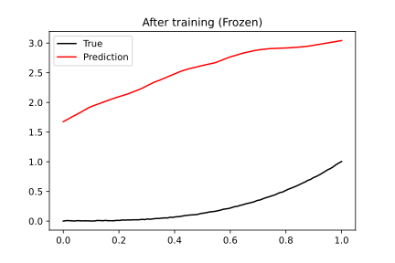

<div align="center">
</div>

<h2 align="center">The ✨Magical✨ JAX NN Library.</h2>
<h5 align = "center"> *Serket is the goddess of magic in Egyptian mythology 

[**Installation**](#Installation)
|[**Description**](#Description)
|[**Quick Example**](#QuickExample)
|[**Freezing/Fine tuning**](#Freezing)
|[**Filtering**](#Filtering)


[](https://pepy.tech/project/serket)
[](https://codecov.io/gh/ASEM000/serket)


</h5>


## 🛠️ Installation<a id="Installation"></a>

```python
pip install serket
```
**Install development version**
```python
pip install git+https://github.com/ASEM000/serket
```


## 📖 Description<a id="Description"></a>
- `serket` aims to be the most intuitive and easy-to-use Neural network library in JAX.
- `serket` is built on top of [`pytreeclass`](https://github.com/ASEM000/pytreeclass)

- `serket` currently implements 

| Group | Layers |
| ------------- | ------------- |
| Linear  | `Linear`, `Bilinear`, `FNN` (Fully connected network), `PFNN` (Parallel fully connected network)  |
| Convolution | `Conv1D`, `Conv2D`, `Conv3D`, `Conv1DTranspose` , `Conv2DTranspose`, `Conv3DTranspose`, `DepthwiseConv1D`, `DepthwiseConv2D`, `DepthwiseConv3D` |
| Containers| `Sequential`, `Lambda` |
|Activation| `AdaptiveReLU`, `AdaptiveLeakyReLU`, `AdaptiveSigmoid`, `AdaptiveTanh`|
|Pooling|`MaxPool1D`, `MaxPool2D`, `MaxPool3D`, `AvgPool1D`, `AvgPool2D`, `AvgPool3D` `GlobalMaxPool1D`, `GlobalMaxPool2D`, `GlobalMaxPool3D`, `GlobalAvgPool1D`, `GlobalAvgPool2D`, `GlobalAvgPool3D`|
|Reshaping|`Flatten`, `Unflatten`, `FlipLeftRight2D`, `FlipUpDown2D`, `Repeat1D`, `Repeat2D`, `Repeat3D`, `Resize1D`, `Resize2D`, `Resize3D`, `Upsampling1D`, `Upsampling2D`, `Upsampling3D`, `Padding1D`, `Padding2D`, `Padding3D` |
|Recurrent|`RNNCell`, `LSTMCell`|
|Normalization|`LayerNorm`|
|Blurring| `AvgBlur2D`|
|Physics|`Laplace2D` |
|Blocks|`VGG16Block`, `VGG19Block`|


## ⏩ Quick Example <a id="QuickExample">

Simple Fully connected neural network.

### 🏗️ Model definition
```python
import serket as sk 
import jax
import jax.numpy as jnp
import jax.random as jr

@sk.treeclass
class NN:
    def __init__(
        self, 
        in_features:int, 
        out_features:int, 
        hidden_features: int, key:jr.PRNGKey = jr.PRNGKey(0)):

        k1,k2,k3 = jr.split(key, 3)

        self.l1 = sk.nn.Linear(in_features, hidden_features, key=k1)
        self.l2 = sk.nn.Linear(hidden_features, hidden_features, key=k2)
        self.l3 = sk.nn.Linear(hidden_features, out_features, key=k3)
    
    def __call__(self, x):
        x = self.l1(x)
        x = jax.nn.relu(x)
        x = self.l2(x)
        x = jax.nn.relu(x)
        x = self.l3(x)
        return x

model = NN(
    in_features=1, 
    out_features=1, 
    hidden_features=128, 
    key=jr.PRNGKey(0))
```
### 🎨 Visualize


<details>
<summary> Model representation `__repr__` </summary>

```python
print(f"{model!r}")
# `*` represents untrainable(static) nodes.
NN(
  l1=Linear(
    weight=f32[1,128],
    bias=f32[128],
    *in_features=1,
    *out_features=128,
    *weight_init_func=init(key,shape,dtype),
    *bias_init_func=Lambda(key,shape)
  ),
  l2=Linear(
    weight=f32[128,128],
    bias=f32[128],
    *in_features=128,
    *out_features=128,
    *weight_init_func=init(key,shape,dtype),
    *bias_init_func=Lambda(key,shape)
  ),
  l3=Linear(
    weight=f32[128,1],
    bias=f32[1],
    *in_features=128,
    *out_features=1,
    *weight_init_func=init(key,shape,dtype),
    *bias_init_func=Lambda(key,shape)
  )
)
```

</details>

<details>
<summary> Model values `__str__` </summary>

```python
print(f"{model!s}")
# `*` represents untrainable(static) nodes.

NN(
  l1=Linear(
    weight=
      [[-0.556661   -0.6288703   1.28644    -2.9053314  -0.9808919   0.02763719
        -1.5992663   0.3522784  -0.72343904  2.1087773  -1.184502    0.37314773
         0.13440615 -1.1792887   2.646051   -0.31855923  1.2535691  -0.350722
         0.24288356  0.8924919   1.8751624  -0.4494902  -0.6869111   2.4898252
         1.0088646   2.3707743  -1.212474   -0.19152707  0.51991814 -0.801294
         1.9568022  -0.05682194  0.7434735   0.24796781 -0.31967887 -0.6026076
         0.02562018 -2.1735084  -0.7877185   1.1945596  -0.5776542  -0.08814432
         0.01738743  0.85175467 -2.4330282   2.400132   -0.15812641 -2.2410994
         1.8925649  -1.4573553  -1.5524752   0.2746206   0.99534875 -0.52039754
        -1.6240916   0.57301414  1.2754964   0.39254263  1.5842631  -0.4408383
         0.22060809 -0.11473875  1.2702179   0.14604266 -1.1393331  -0.20517357
         2.8613555  -0.76657873 -2.7623959   1.4629859   1.7641917   1.4639573
         0.90266997 -1.4661105   1.1719718   0.6656477  -0.6834308   1.0311401
        -3.0281627   1.7895395  -1.248399   -0.13082643  2.1665883   2.8423917
         0.24363454  0.20664148  1.7082529   2.129452    0.2974662  -0.8575109
        -0.5970874   0.01702698 -0.18604587  0.7464636   0.83206064  0.6965974
         0.7219791   0.8652629   1.3164111  -2.788336   -0.06530724 -0.7846771
        -0.7344756   1.5899261   0.2623837  -0.01147135 -0.5437088   0.68380916
        -1.5405492   1.1371891  -0.67851156 -0.37528485 -0.0336573  -2.0287845
         0.3067764  -1.3464272  -0.6037441  -1.6209227  -2.3215613  -3.062661
         0.5440992  -0.8735671   0.9094481   2.3398476   0.5821143   1.9373481
        -0.36942863  2.5151203 ]],
    bias=
      [1. 1. 1. 1. 1. 1. 1. 1. 1. 1. 1. 1. 1. 1. 1. 1. 1. 1. 1. 1. 1. 1. 1. 1.
       1. 1. 1. 1. 1. 1. 1. 1. 1. 1. 1. 1. 1. 1. 1. 1. 1. 1. 1. 1. 1. 1. 1. 1.
       1. 1. 1. 1. 1. 1. 1. 1. 1. 1. 1. 1. 1. 1. 1. 1. 1. 1. 1. 1. 1. 1. 1. 1.
       1. 1. 1. 1. 1. 1. 1. 1. 1. 1. 1. 1. 1. 1. 1. 1. 1. 1. 1. 1. 1. 1. 1. 1.
       1. 1. 1. 1. 1. 1. 1. 1. 1. 1. 1. 1. 1. 1. 1. 1. 1. 1. 1. 1. 1. 1. 1. 1.
       1. 1. 1. 1. 1. 1. 1. 1.],
    *in_features=1,
    *out_features=128,
    *weight_init_func=init(key,shape,dtype),
    *bias_init_func=Lambda(key,shape)
  ),
  l2=Linear(
    weight=
      [[ 0.01565691 -0.02781865  0.15829083 ...  0.00930642  0.03536453
         0.01890953]
       [-0.01510135  0.1975845   0.2470963  ... -0.13168702  0.01404842
        -0.21973991]
       [-0.07814246 -0.18890998 -0.26707044 ... -0.15391685 -0.16248046
        -0.11042175]
       ...
       [-0.01806537  0.01311939  0.00696071 ... -0.18970545  0.07411639
        -0.04393121]
       [ 0.07426595  0.19547018 -0.26033685 ... -0.01357261 -0.00193011
        -0.00152987]
       [-0.00897581 -0.0115421   0.08062097 ... -0.098473    0.1083767
         0.12410464]],
    bias=
      [1. 1. 1. 1. 1. 1. 1. 1. 1. 1. 1. 1. 1. 1. 1. 1. 1. 1. 1. 1. 1. 1. 1. 1.
       1. 1. 1. 1. 1. 1. 1. 1. 1. 1. 1. 1. 1. 1. 1. 1. 1. 1. 1. 1. 1. 1. 1. 1.
       1. 1. 1. 1. 1. 1. 1. 1. 1. 1. 1. 1. 1. 1. 1. 1. 1. 1. 1. 1. 1. 1. 1. 1.
       1. 1. 1. 1. 1. 1. 1. 1. 1. 1. 1. 1. 1. 1. 1. 1. 1. 1. 1. 1. 1. 1. 1. 1.
       1. 1. 1. 1. 1. 1. 1. 1. 1. 1. 1. 1. 1. 1. 1. 1. 1. 1. 1. 1. 1. 1. 1. 1.
       1. 1. 1. 1. 1. 1. 1. 1.],
    *in_features=128,
    *out_features=128,
    *weight_init_func=init(key,shape,dtype),
    *bias_init_func=Lambda(key,shape)
  ),
  l3=Linear(
    weight=
      [[-0.13613197]
       [ 0.14116174]
       [-0.06744987]
       [-0.08091136]
       [-0.27361065]
       [-0.06548355]
       [ 0.01022272]
       [ 0.0252317 ]
       [ 0.0237782 ]
       [ 0.00614042]
       [ 0.1812661 ]
       [-0.06621032]
       [ 0.16613998]
       [-0.05014007]
       [-0.21103479]
       [-0.11941364]
       [ 0.00036292]
       [ 0.00039283]
       [ 0.08278123]
       [ 0.10028461]
       [ 0.07373375]
       [ 0.04089416]
       [-0.00426106]
       [-0.0247845 ]
       [ 0.2804994 ]
       [-0.11494187]
       [ 0.26255226]
       [-0.05349432]
       [-0.16621305]
       [ 0.0187737 ]
       [ 0.11997257]
       [ 0.24926668]
       [ 0.12966438]
       [ 0.02550141]
       [ 0.18541676]
       [-0.09129915]
       [-0.22716352]
       [-0.18755099]
       [ 0.1665244 ]
       [-0.10028487]
       [ 0.09164064]
       [-0.02597431]
       [-0.15029983]
       [-0.02553205]
       [ 0.16129787]
       [-0.07182706]
       [-0.07004812]
       [-0.03763127]
       [-0.06973497]
       [-0.0998554 ]
       [ 0.00957549]
       [ 0.0948947 ]
       [-0.11812133]
       [ 0.00408699]
       [ 0.18451509]
       [-0.2392044 ]
       [ 0.1889591 ]
       [ 0.20876819]
       [ 0.16006592]
       [ 0.11820399]
       [ 0.13270618]
       [-0.02642066]
       [-0.03972287]
       [ 0.0130475 ]
       [ 0.12387222]
       [-0.07360736]
       [-0.07168346]
       [ 0.26462224]
       [-0.24544406]
       [ 0.02614611]
       [ 0.17016351]
       [-0.10638441]
       [-0.01891194]
       [ 0.02476142]
       [ 0.00474042]
       [ 0.06326718]
       [-0.10003307]
       [ 0.03704525]
       [-0.17377096]
       [ 0.02369826]
       [-0.09041592]
       [ 0.06363823]
       [-0.00131075]
       [-0.19338304]
       [ 0.2741859 ]
       [-0.03178171]
       [-0.0061704 ]
       [ 0.01059608]
       [ 0.17419283]
       [ 0.08168265]
       [ 0.08119942]
       [ 0.07225287]
       [-0.02761899]
       [ 0.11468761]
       [ 0.0180395 ]
       [-0.04214213]
       [-0.10949433]
       [-0.03126818]
       [ 0.14708327]
       [-0.25051817]
       [ 0.0431254 ]
       [ 0.10890955]
       [-0.00171187]
       [-0.07619253]
       [ 0.16909993]
       [-0.11504915]
       [ 0.02266672]
       [ 0.22796142]
       [ 0.05010169]
       [-0.26961675]
       [-0.02833704]
       [-0.21504459]
       [ 0.00469143]
       [ 0.23426442]
       [ 0.04301503]
       [-0.13504943]
       [-0.1914389 ]
       [-0.1553146 ]
       [ 0.00082878]
       [-0.05092873]
       [-0.13719554]
       [-0.24856809]
       [-0.05966872]
       [-0.04416765]
       [ 0.12827884]
       [-0.06721988]
       [ 0.05502734]
       [ 0.03519182]],
    bias=[1.],
    *in_features=128,
    *out_features=1,
    *weight_init_func=init(key,shape,dtype),
    *bias_init_func=Lambda(key,shape)
  )
)

```

</details>


<details>
<summary>Tree diagram</summary>

```python
# `*` represents untrainable(static) nodes.
print(model.tree_diagram())
NN
    ├── l1=Linear
    │   ├── weight=f32[1,128]
    │   ├── bias=f32[128]
    │   ├*─ in_features=1
    │   ├*─ out_features=128
    │   ├*─ weight_init_func=init(key,shape,dtype)
    │   └*─ bias_init_func=Lambda(key,shape)    
    ├── l2=Linear
    │   ├── weight=f32[128,128]
    │   ├── bias=f32[128]
    │   ├*─ in_features=128
    │   ├*─ out_features=128
    │   ├*─ weight_init_func=init(key,shape,dtype)
    │   └*─ bias_init_func=Lambda(key,shape)    
    └── l3=Linear
        ├── weight=f32[128,1]
        ├── bias=f32[1]
        ├*─ in_features=128
        ├*─ out_features=1
        ├*─ weight_init_func=init(key,shape,dtype)
        └*─ bias_init_func=Lambda(key,shape) 
```
</details>


<details> <summary> Tree summary  </summary>

```python
>>> print(model.summary())
┌────┬──────┬─────────┬───────┬───────────────────┐
│Name│Type  │Param #  │Size   │Config             │
├────┼──────┼─────────┼───────┼───────────────────┤
│l1  │Linear│256(0)   │1.00KB │weight=f32[1,128]  │
│    │      │         │(0.00B)│bias=f32[128]      │
├────┼──────┼─────────┼───────┼───────────────────┤
│l2  │Linear│16,512(0)│64.50KB│weight=f32[128,128]│
│    │      │         │(0.00B)│bias=f32[128]      │
├────┼──────┼─────────┼───────┼───────────────────┤
│l3  │Linear│129(0)   │516.00B│weight=f32[128,1]  │
│    │      │         │(0.00B)│bias=f32[1]        │
└────┴──────┴─────────┴───────┴───────────────────┘
Total count :	16,897(0)
Dynamic count :	16,897(0)
Frozen count :	0(0)
---------------------------------------------------
Total size :	66.00KB(0.00B)
Dynamic size :	66.00KB(0.00B)
Frozen size :	0.00B(0.00B)
===================================================
```

</details>

<details>

<summary> Tree summary with shape inference </summary>
**Using `model.summary(array=input_array)` `serket` can evaluate the shape propagation without evaluating the model , by using `jax` no-flop shape inference operations.**

```python
print(model.summary(array=x))

┌────┬──────┬─────────┬───────┬───────────────────┬────────────┐
│Name│Type  │Param #  │Size   │Config             │Input/Output│
├────┼──────┼─────────┼───────┼───────────────────┼────────────┤
│l1  │Linear│256(0)   │1.00KB │weight=f32[1,128]  │f32[100,1]  │
│    │      │         │(0.00B)│bias=f32[128]      │f32[100,128]│
├────┼──────┼─────────┼───────┼───────────────────┼────────────┤
│l2  │Linear│16,512(0)│64.50KB│weight=f32[128,128]│f32[100,128]│
│    │      │         │(0.00B)│bias=f32[128]      │f32[100,128]│
├────┼──────┼─────────┼───────┼───────────────────┼────────────┤
│l3  │Linear│129(0)   │516.00B│weight=f32[128,1]  │f32[100,128]│
│    │      │         │(0.00B)│bias=f32[1]        │f32[100,1]  │
└────┴──────┴─────────┴───────┴───────────────────┴────────────┘
Total count :	16,897(0)
Dynamic count :	16,897(0)
Frozen count :	0(0)
----------------------------------------------------------------
Total size :	66.00KB(0.00B)
Dynamic size :	66.00KB(0.00B)
Frozen size :	0.00B(0.00B)
================================================================

```

</details>

### ‍🔧 Train
```python
import matplotlib.pyplot as plt

x = jnp.linspace(0,1,100)[:,None]
y = x**3 + jax.random.uniform(jax.random.PRNGKey(0),(100,1))*0.01


@jax.value_and_grad
def loss_func(model,x,y):
    return jnp.mean((model(x)-y)**2)

@jax.jit
def update(model,x,y):
    value,grad = loss_func(model,x,y)
    return value , model - 1e-3*grad

plt.plot(x,y,'-k',label='True')
plt.plot(x,model(x),'-r',label='Prediction')
plt.title("Before training")
plt.legend()
plt.show()

for _ in range(20_000):
    value,model = update(model,x,y)

plt.plot(x,y,'-k',label='True')
plt.plot(x,model(x),'-r',label='Prediction')
plt.title("After training")
plt.legend()
plt.show()
```

<div align = "center" >
<table><tr>
<td><div align = "center" > </div></td>
<td><div align = "center" > </div></td>
</tr>
</table>
</div>

## 🥶 Freezing parameters /Fine tuning<a id="Freezing" >
<!-- In `serket` simply use `.at[...].freeze()`/`.at[...].unfreeze()` on `treeclass` instance to freeze/unfreeze it is parameters.
```python
# Freeze the entire model
frozen_model = model.at[...].freeze()

# To freeze a certain sub module
# use model = model.at["sub_module name"].freeze()

@jax.value_and_grad
def loss_func(model,x,y):
    return jnp.mean((model(x)-y)**2)

@jax.jit
def update(model,x,y):
    value,grad = loss_func(model,x,y)
    return value , model - 1e-3*grad

plt.plot(x,y,'-k',label='True')
plt.plot(x,frozen_model(x),'-r',label='Prediction')
plt.title("Before training")
plt.legend()

plt.show()
for _ in range(20_000):
    value,frozen_model = update(frozen_model,x,y)

plt.plot(x,y,'-k',label='True')
plt.plot(x,frozen_model(x),'-r',label='Prediction')
plt.title("After training")
plt.legend()
plt.show()
```

<div align="center">
<table><tr>
<td><div align = "center" > </div></td>
<td><div align = "center" > </div></td>
</tr>
</table>
</div> -->


## 🔘 Filtering by masking<a id="Filterning" >

### Filter by value
```python
# get model negative values
negative_model = model.at[model<0].get()

# Set negative values to 0
zeroed_model = model.at[model<0].set(0)

# Apply `jnp.cos` to negative values
cosined_model = model.at[model<0].apply(jnp.cos)
```
### Filter by field name 
```python
# get model layer named `l1`
l1_model = model.at[model == "l1" ].get()

# Set `l1` values to 0
zeroed_model = model.at[model == "l1" ].set(0)

# Apply `jnp.cos` to `l1` 
cosined_model = model.at[model == "l1" ].apply(jnp.cos)
```

### Filter by field type
```python
# get all model `Linear` layers
l1_model = model.at[model == sk.nn.Linear ].get()

# Set `Linear` layers to 0
zeroed_model = model.at[model == sk.nn.Linear ].set(0)

# Apply `jnp.cos` to all `Linear` layers 
cosined_model = model.at[model == sk.nn.Linear ].apply(jnp.cos)
```

### Filter by mixed masks
```
# Set all `Linear` bias to 0
mask = (model == sk.nn.Linear) & (model == "bias" )
zero_bias_model = model.at[mask].set(0.)
```

✨[See here for more about filterning ](https://github.com/ASEM000/PyTreeClass#%EF%B8%8F-filtering-with-at-)✨
