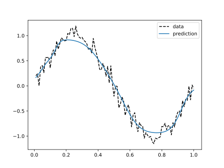
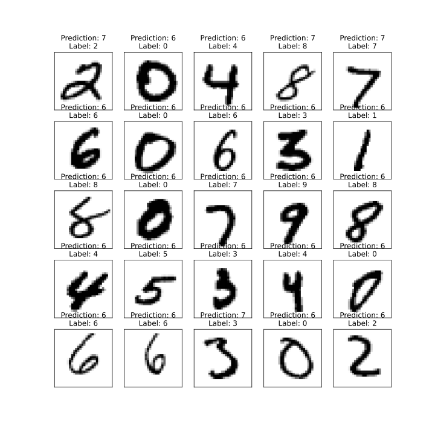
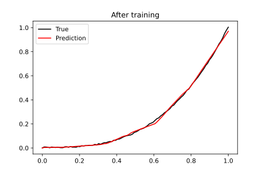
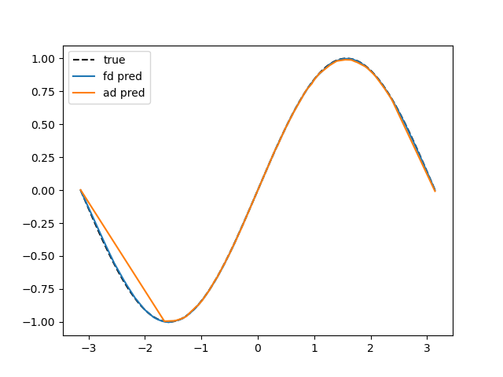
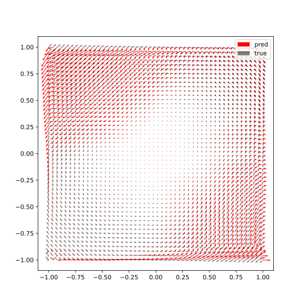

<div align="center">
</div>

<h2 align="center">The ✨Magical✨ JAX Scientific ML Library.</h2>
<h5 align = "center"> *Serket is the goddess of magic in Egyptian mythology

[**Installation**](#Installation)
|[**Description**](#Description)
|[**Quick Example**](#QuickExample)
|[**Freezing/Fine tuning**](#Freezing)
|[**Filtering**](#Filtering)


[](https://pepy.tech/project/serket)
[](https://codecov.io/gh/ASEM000/serket)
[](https://zenodo.org/badge/latestdoi/526985786)


</h5>

## 🛠️ Installation<a id="Installation"></a>

```python
pip install serket
```

**Install development version**

```python
pip install git+https://github.com/ASEM000/serket
```

## 📖 Description and motivation<a id="Description"></a>

- `serket` aims to be the most intuitive and easy-to-use physics-based Neural network library in JAX.
- `serket` is fully transparent to `jax` transformation (e.g. `vmap`,`grad`,`jit`,...)
- `serket` current aim to facilitate the integration of numerical methods in a NN setting (see examples for more)

### Layer structure

`serket` is built on top of [`PyTreeClass`](https://github.com/ASEM000/pytreeclass), this means that layers are represented as a [PyTree](https://jax.readthedocs.io/en/latest/pytrees.html) whose leaves are the layer parameters.

<div align="center">

### 🧠 Neural network package: `serket.nn` 🧠

| Group                           | Layers                                                                                                                                                                                                                                                                                                                                                 |
| ------------------------------- | ------------------------------------------------------------------------------------------------------------------------------------------------------------------------------------------------------------------------------------------------------------------------------------------------------------------------------------------------------ |
| Linear                          | - `Linear`, `Bilinear`, `Multilinear`, `GeneralLinear`, `Identity`, `Embedding`                                                                                                                                                                                                                                                                        |
| Densely connected               | - `FNN` (Fully connected network),                                                                                                                                                                                                                                                                                                                     |
| Convolution                     | - `{Conv,FFTConv}{1D,2D,3D}` <br> - `{Conv,FFTConv}{1D,2D,3D}Transpose` <br> - `{Depthwise,Separable}{Conv,FFTConv}{1D,2D,3D}` <br> - `Conv{1D,2D,3D}Local`                                                                                                                                                                                            |
| Containers                      | - `Sequential`, `Lambda`                                                                                                                                                                                                                                                                                                                               |
| Pooling <br> (`kernex` backend) | - `{Avg,Max,LP}Pool{1D,2D,3D}` <br> - `Global{Avg,Max}Pool{1D,2D,3D}` <br> - `Adaptive{Avg,Max}Pool{1D,2D,3D}`                                                                                                                                                                                                                                         |
| Reshaping                       | - `Flatten`, `Unflatten`, <br> - `FlipLeftRight2D`, `FlipUpDown2D` <br> - `Resize{1D,2D,3D}` <br> - `Upsample{1D,2D,3D}` <br> - `Pad{1D,2D,3D}`                                                                                                                                                                                                        |
| Crop                            | - `Crop{1D,2D}`                                                                                                                                                                                                                                                                                                                                        |
| Normalization                   | - `{Layer,Instance,Group}Norm`                                                                                                                                                                                                                                                                                                                         |
| Blurring                        | - `{Avg,Gaussian}Blur2D`                                                                                                                                                                                                                                                                                                                               |
| Dropout                         | - `Dropout`<br> - `Dropout{1D,2D,3D}`                                                                                                                                                                                                                                                                                                                  |
| Random transforms               | - `RandomCrop{1D,2D}` <br> - `RandomApply`, <br> - `RandomCutout{1D,2D}` <br> - `RandomZoom2D`, <br> - `RandomContrast2D`                                                                                                                                                                                                                              |
| Misc                            | - `HistogramEqualization2D`, `AdjustContrast2D`, `Filter2D`, `PixelShuffle2D`                                                                                                                                                                                                                                                                          |
| Activations                     | - `Adaptive{LeakyReLU,ReLU,Sigmoid,Tanh}`,<br> - `CeLU`,`ELU`,`GELU`,`GLU`<br>- `Hard{SILU,Shrink,Sigmoid,Swish,Tanh}`, <br> - `Soft{Plus,Sign,Shrink}` <br> - `LeakyReLU`,`LogSigmoid`,`LogSoftmax`,`Mish`,`PReLU`,<br> - `ReLU`,`ReLU6`,`SILU`,`SeLU`,`Sigmoid` <br> - `Swish`,`Tanh`,`TanhShrink`, `ThresholdedReLU`, `Snake`, `Stan`, `SquarePlus` |
| Recurrent cells                 | - `{SimpleRNN,LSTM,GRU}Cell` <br> - `Conv{LSTM,GRU}{1D,2D,3D}Cell`                                                                                                                                                                                                                                                                                     |
| Blocks                          | - `VGG{16,19}Block`, `UNetBlock`                                                                                                                                                                                                                                                                                                                       |

</div>

## ⏩ Examples: <a id="QuickExample">

<details>
<summary> Linear layers examples</summary>

```python
import jax.numpy as jnp

import serket as sk

# Linear
x = jnp.ones([1, 2, 3, 4])
l1 = sk.nn.Linear(4, 5)  # last dim is 4, output dim is 5
print(l1(x).shape)  # (1, 2, 3, 5)

# Bilinear
x1, x2 = jnp.ones([1, 2, 3, 4]), jnp.ones([1, 2, 3, 5])
l2 = sk.nn.Bilinear(4, 5, 6)  # last dim of the input x1,x2 are 4,5, output dim is 6
print(l2(x1, x2).shape)  # (1, 2, 3, 6)

# Multilinear
x1, x2, x3 = jnp.ones([1, 2, 3, 4]), jnp.ones([1, 2, 3, 5]), jnp.ones([1, 2, 3, 6])
l3 = sk.nn.Multilinear((4, 5, 6), 7)  # last dim for x1,x2,x3 = 4,5,6, output dim is 7
print(l3(x1, x2, x3).shape)  # (1, 2, 3, 7)

# GeneralLinear
x = jnp.ones([4, 5, 6, 7])
# apply a linear layer to axis 1,2,3, with dim = (5, 6, 7) and output dim is 5
l4 = sk.nn.GeneralLinear((5, 6, 7), 5, in_axes=(1, 2, 3))
print(l4(x).shape)  # (4, 5)
```

</details>

<details>
<summary>
Train Bidirectional-LSTM
</summary>

```python
import jax
import jax.numpy as jnp
import jax.random as jr
import matplotlib.pyplot as plt
import optax  # for gradient optimization

import serket as sk

x = jnp.linspace(0, 1, 101).reshape(-1, 1)  # 101 samples of 1D data
y = jnp.sin(2 * jnp.pi * x)
y += 0.1 * jr.normal(jr.PRNGKey(0), y.shape)

# we will use 2 time steps to predict the next time step
x_batched = jnp.stack([x[:-1], x[1:]], axis=1)
x_batched = jnp.reshape(x_batched, (100, 1, 2, 1))  # 100 minibatches x 1 sample x 2 time steps x 1D data
y_batched = jnp.reshape(y[1:], (100, 1, 1))  # 100 minibatches x 1 samples x 1D data

model = sk.nn.Sequential(
    [
        # first cell is the forward cell, second cell is the backward cell for bidirectional RNN
        # we return the full sequence of outputs for each cell by setting return_sequences=True
        # we use None in place of `in_features` to infer the input shape from the input
        sk.nn.ScanRNN(
            sk.nn.LSTMCell(None, 64),
            backward_cell=sk.nn.LSTMCell(None, 64),
            return_sequences=True,
        ),
        # here the in_features is inferred from the previous layer by setting it to None
        # or simply we can set it to 64*2 (64 for each cell from previous layer)
        # we set return_sequences=False to return only the last output of the sequence
        sk.nn.ScanRNN(sk.nn.LSTMCell(None, 1), return_sequences=False),
    ]
)


@jax.value_and_grad
def loss_func(NN, batched_x, batched_y):
    # use jax.vmap to apply the model to each minibatch
    # in our case single x minibatch has shape (1, 2, 1)
    # and single y minibatch has shape (1, 1)
    # then vmap will be applied to the leading axis
    batched_preds = jax.vmap(NN)(batched_x)
    return jnp.mean((batched_preds - batched_y) ** 2)


@jax.jit
def batch_step(NN, batched_x, batched_y, opt_state):
    loss, grads = loss_func(NN, batched_x, batched_y)
    updates, optim_state = optim.update(grads, opt_state)
    NN = optax.apply_updates(NN, updates)
    return NN, optim_state, loss


# dry run to infer the in_features (i.e. replace None with in_features)
# if you want restrict the model to a specific input shape or to avoid
# confusion you can manually specify the in_features as a consequence
# dry run is not necessary in this case
model(x_batched[0, 0])

optim = optax.adam(1e-3)
opt_state = optim.init(model)

epochs = 100

for i in range(1, epochs + 1):
    epoch_loss = []
    for x_b, y_b in zip(x_batched, y_batched):
        model, opt_state, loss = batch_step(model, x_b, y_b, opt_state)
        epoch_loss.append(loss)

    epoch_loss = jnp.mean(jnp.array(epoch_loss))

    if i % 10 == 0:
        print(f"Epoch {i:3d} Loss {epoch_loss:.4f}")

# Epoch  10 Loss 0.0880
# Epoch  20 Loss 0.0796
# Epoch  30 Loss 0.0620
# Epoch  40 Loss 0.0285
# Epoch  50 Loss 0.0205
# Epoch  60 Loss 0.0187
# Epoch  70 Loss 0.0182
# Epoch  80 Loss 0.0176
# Epoch  90 Loss 0.0171
# Epoch 100 Loss 0.0166

y_pred = jax.vmap(model)(x_batched.reshape(-1, 2, 1))
plt.plot(x[1:], y[1:], "--k", label="data")
plt.plot(x[1:], y_pred, label="prediction")
plt.legend()
```



</details>

<details>

<summary>Lazy initialization</summary>

In cases where `in_features` needs to be inferred from input, use `None` instead of `in_features` to infer the value at runtime.
However, since the lazy module initialize it's state after the first call (i.e. mutate it's state) `jax` transformation ex: `vmap, grad ...` is not allowed before initialization. Using any `jax` transformation before initialization will throw a `ValueError`.

```python
import serket as sk
import jax
import jax.numpy as jnp

model = sk.nn.Sequential(
    [
        sk.nn.Conv2D(None, 128, 3),
        sk.nn.ReLU(),
        sk.nn.MaxPool2D(2, 2),
        sk.nn.Conv2D(128, 64, 3),
        sk.nn.ReLU(),
        sk.nn.MaxPool2D(2, 2),
        sk.nn.Flatten(),
        sk.nn.Linear(None, 128),
        sk.nn.ReLU(),
        sk.nn.Linear(128, 1),
    ]
)

# print the first `Conv2D` layer before initialization
print(model[0].__repr__())
# Conv2D(
#   weight=None,
#   bias=None,
#   *in_features=None,
#   *out_features=None,
#   *kernel_size=None,
#   *strides=None,
#   *padding=None,
#   *input_dilation=None,
#   *kernel_dilation=None,
#   weight_init_func=None,
#   bias_init_func=None,
#   *groups=None
# )

try :
    jax.vmap(model)(jnp.ones((10, 1,28, 28)))
except ValueError:
    print("***** Not initialized *****")
# ***** Not initialized *****

# dry run to initialize the model
model(jnp.empty([3,128,128]))

print(model[0].__repr__())
# Conv2D(
#   weight=f32[128,3,3,3],
#   bias=f32[128,1,1],
#   *in_features=3,
#   *out_features=128,
#   *kernel_size=(3,3),
#   *strides=(1,1),
#   *padding=((1,1),(1,1)),
#   *input_dilation=(1,1),
#   *kernel_dilation=(1,1),
#   weight_init_func=Partial(glorot_uniform(key,shape,dtype)),
#   bias_init_func=Partial(zeros(key,shape,dtype)),
#   *groups=1
# )
```

</details>

<details>

<summary>Train MNIST</summary>

We will use `tensorflow` datasets for dataloading. for more on interface of jax/tensorflow dataset see [here](https://jax.readthedocs.io/en/latest/notebooks/neural_network_with_tfds_data.html)

```python
# imports
import tensorflow as tf
# Ensure TF does not see GPU and grab all GPU memory.
tf.config.set_visible_devices([], device_type="GPU")
import tensorflow_datasets as tfds
import tensorflow.experimental.numpy as tnp
import jax
import jax.numpy as jnp
import jax.random as jr
import optax  # for gradient optimization
import serket as sk
import matplotlib.pyplot as plt
import functools as ft
```

```python
# Construct a tf.data.Dataset
batch_size = 128

# convert the samples from integers to floating-point numbers
# and channel first format
def preprocess_data(x):
    # convert to channel first format
    image = tnp.moveaxis(x["image"], -1, 0)
    # normalize to [0, 1]
    image = tf.cast(image, tf.float32) / 255.0

    # one-hot encode the labels
    label = tf.one_hot(x["label"], 10) / 1.0
    return {"image": image, "label": label}


ds_train, ds_test = tfds.load("mnist", split=["train", "test"], shuffle_files=True)
# (batches, batch_size, 1, 28, 28)
ds_train = ds_train.shuffle(1024).map(preprocess_data).batch(batch_size).prefetch(tf.data.AUTOTUNE)

# (batches, 1, 28, 28)
ds_test = ds_test.map(preprocess_data).prefetch(tf.data.AUTOTUNE)
```

### 🏗️ Model definition

We will use `jax.vmap(model)` to apply `model` on batches.

```python
@sk.treeclass
class CNN:
    def __init__(self):
        self.conv1 = sk.nn.Conv2D(1, 32, (3, 3), padding="valid")
        self.relu1 = sk.nn.ReLU()
        self.pool1 = sk.nn.MaxPool2D((2, 2), strides=(2, 2))
        self.conv2 = sk.nn.Conv2D(32, 64, (3, 3), padding="valid")
        self.relu2 = sk.nn.ReLU()
        self.pool2 = sk.nn.MaxPool2D((2, 2), strides=(2, 2))
        self.flatten = sk.nn.Flatten(start_dim=0)
        self.dropout = sk.nn.Dropout(0.5)
        self.linear = sk.nn.Linear(5*5*64, 10)

    def __call__(self, x):
        x = self.conv1(x)
        x = self.relu1(x)
        x = self.pool1(x)
        x = self.conv2(x)
        x = self.relu2(x)
        x = self.pool2(x)
        x = self.flatten(x)
        x = self.dropout(x)
        x = self.linear(x)
        return x

model = CNN()
```

### 🎨 Visualize model

<details><summary>Model summary</summary>
    
```python
print(model.summary(show_config=False, array=jnp.empty((1, 28, 28))))  
┌───────┬─────────┬─────────┬──────────────┬─────────────┬─────────────┐
│Name   │Type     │Param #  │Size          │Input        │Output       │
├───────┼─────────┼─────────┼──────────────┼─────────────┼─────────────┤
│conv1  │Conv2D   │320(0)   │1.25KB(0.00B) │f32[1,28,28] │f32[32,26,26]│
├───────┼─────────┼─────────┼──────────────┼─────────────┼─────────────┤
│relu1  │ReLU     │0(0)     │0.00B(0.00B)  │f32[32,26,26]│f32[32,26,26]│
├───────┼─────────┼─────────┼──────────────┼─────────────┼─────────────┤
│pool1  │MaxPool2D│0(0)     │0.00B(0.00B)  │f32[32,26,26]│f32[32,13,13]│
├───────┼─────────┼─────────┼──────────────┼─────────────┼─────────────┤
│conv2  │Conv2D   │18,496(0)│72.25KB(0.00B)│f32[32,13,13]│f32[64,11,11]│
├───────┼─────────┼─────────┼──────────────┼─────────────┼─────────────┤
│relu2  │ReLU     │0(0)     │0.00B(0.00B)  │f32[64,11,11]│f32[64,11,11]│
├───────┼─────────┼─────────┼──────────────┼─────────────┼─────────────┤
│pool2  │MaxPool2D│0(0)     │0.00B(0.00B)  │f32[64,11,11]│f32[64,5,5]  │
├───────┼─────────┼─────────┼──────────────┼─────────────┼─────────────┤
│flatten│Flatten  │0(0)     │0.00B(0.00B)  │f32[64,5,5]  │f32[1600]    │
├───────┼─────────┼─────────┼──────────────┼─────────────┼─────────────┤
│dropout│Dropout  │0(0)     │0.00B(0.00B)  │f32[1600]    │f32[1600]    │
├───────┼─────────┼─────────┼──────────────┼─────────────┼─────────────┤
│linear │Linear   │16,010(0)│62.54KB(0.00B)│f32[1600]    │f32[10]      │
└───────┴─────────┴─────────┴──────────────┴─────────────┴─────────────┘
Total count :	34,826(0)
Dynamic count :	34,826(0)
Frozen count :	0(0)
------------------------------------------------------------------------
Total size :	136.04KB(0.00B)
Dynamic size :	136.04KB(0.00B)
Frozen size :	0.00B(0.00B)
========================================================================
```
        
</details>

<details><summary>tree diagram </summary>
    
```python
print(model.tree_diagram())
CNN
    ├── conv1=Conv2D
    │   ├── weight=f32[32,1,3,3]
    │   ├── bias=f32[32,1,1]
    │   ├*─ in_features=1
    │   ├*─ out_features=32
    │   ├*─ kernel_size=(3, 3)
    │   ├*─ strides=(1, 1)
    │   ├*─ padding=((0, 0), (0, 0))
    │   ├*─ input_dilation=(1, 1)
    │   ├*─ kernel_dilation=(1, 1)
    │   ├── weight_init_func=Partial(init(key,shape,dtype))
    │   ├── bias_init_func=Partial(zeros(key,shape,dtype))
    │   └*─ groups=1    
    ├── relu1=ReLU  
    ├*─ pool1=MaxPool2D
    │   ├*─ kernel_size=(2, 2)
    │   ├*─ strides=(2, 2)
    │   └*─ padding='valid' 
    ├── conv2=Conv2D
    │   ├── weight=f32[64,32,3,3]
    │   ├── bias=f32[64,1,1]
    │   ├*─ in_features=32
    │   ├*─ out_features=64
    │   ├*─ kernel_size=(3, 3)
    │   ├*─ strides=(1, 1)
    │   ├*─ padding=((0, 0), (0, 0))
    │   ├*─ input_dilation=(1, 1)
    │   ├*─ kernel_dilation=(1, 1)
    │   ├── weight_init_func=Partial(init(key,shape,dtype))
    │   ├── bias_init_func=Partial(zeros(key,shape,dtype))
    │   └*─ groups=1    
    ├── relu2=ReLU  
    ├*─ pool2=MaxPool2D
    │   ├*─ kernel_size=(2, 2)
    │   ├*─ strides=(2, 2)
    │   └*─ padding='valid' 
    ├*─ flatten=Flatten
    │   ├*─ start_dim=0
    │   └*─ end_dim=-1  
    ├── dropout=Dropout
    │   ├*─ p=0.5
    │   └── eval=None   
    └── linear=Linear
        ├── weight=f32[1600,10]
        ├── bias=f32[10]
        ├*─ in_features=1600
        └*─ out_features=10  
    
 ```
    
</details>
    
<details><summary>Plot sample predictions before training</summary>
    
```python
 
# set all dropout off
test_model = model.at[model == "eval"].set(True, is_leaf=lambda x: x is None)

def show_images_with_predictions(model, images, one_hot_labels):
logits = jax.vmap(model)(images)
predictions = jnp.argmax(logits, axis=-1)
fig, axes = plt.subplots(5, 5, figsize=(10, 10))
for i, ax in enumerate(axes.flat):
ax.imshow(images[i].reshape(28, 28), cmap="binary")
ax.set(title=f"Prediction: {predictions[i]}\nLabel: {jnp.argmax(one_hot_labels[i], axis=-1)}")
ax.set_xticks([])
ax.set_yticks([])
plt.show()

example = ds_test.take(25).as_numpy_iterator()
example = list(example)
sample_test_images = jnp.stack([x["image"] for x in example])
sample_test_labels = jnp.stack([x["label"] for x in example])

show_images_with_predictions(test_model, sample_test_images, sample_test_labels)

````


</details>

### 🏃 Train the model

```python
@ft.partial(jax.value_and_grad, has_aux=True)
def loss_func(model, batched_images, batched_one_hot_labels):
    logits = jax.vmap(model)(batched_images)
    loss = jnp.mean(optax.softmax_cross_entropy(logits=logits, labels=batched_one_hot_labels))
    return loss, logits


# using optax for gradient updates
optim = optax.adam(1e-3)
optim_state = optim.init(model)


@jax.jit
def batch_step(model, batched_images, batched_one_hot_labels, optim_state):
    (loss, logits), grads = loss_func(model, batched_images, batched_one_hot_labels)
    updates, optim_state = optim.update(grads, optim_state)
    model = optax.apply_updates(model, updates)
    accuracy = jnp.mean(jnp.argmax(logits, axis=-1) == jnp.argmax(batched_one_hot_labels, axis=-1))
    return model, optim_state, loss, accuracy


epochs = 5

for i in range(epochs):
    epoch_accuracy = []
    epoch_loss = []

    for example in ds_train.as_numpy_iterator():
        image, label = example["image"], example["label"]
        model, optim_state, loss, accuracy = batch_step(model, image, label, optim_state)
        epoch_accuracy.append(accuracy)
        epoch_loss.append(loss)

    epoch_loss = jnp.mean(jnp.array(epoch_loss))
    epoch_accuracy = jnp.mean(jnp.array(epoch_accuracy))

    print(f"epoch:{i+1:00d}\tloss:{epoch_loss:.4f}\taccuracy:{epoch_accuracy:.4f}")

# epoch:1	loss:0.2706	accuracy:0.9268
# epoch:2	loss:0.0725	accuracy:0.9784
# epoch:3	loss:0.0533	accuracy:0.9836
# epoch:4	loss:0.0442	accuracy:0.9868
# epoch:5	loss:0.0368	accuracy:0.9889
````

### 🎨 Visualize After training

```python
test_model = model.at[model == "eval"].set(True, is_leaf=lambda x: x is None)
show_images_with_predictions(test_model, sample_test_images, sample_test_labels)
```

<details> 
    


</details>

</details>

<br>


<details>

<summary> Finite difference examples </summary>

```python
import jax

jax.config.update("jax_enable_x64", True)
import jax.numpy as jnp
import numpy.testing as npt

import serket as sk


# lets first define a vector valued function F: R^3 -> R^3
# F = F1, F2
# F1 = x^2 + y^3
# F2 = x^4 + y^3
# F3 = 0
# F = [x**2 + y**3, x**4 + y**3, 0]

x, y, z = [jnp.linspace(0, 1, 100)] * 3
dx, dy, dz = x[1] - x[0], y[1] - y[0], z[1] - z[0]
X, Y, Z = jnp.meshgrid(x, y, z, indexing="ij")
F1 = X**2 + Y**3
F2 = X**4 + Y**3
F3 = jnp.zeros_like(F1)
F = jnp.stack([F1, F2, F3], axis=0)

# ∂F1/∂x : differentiate F1 with respect to x (i.e axis=0)
dF1dx = sk.fd.difference(F1, axis=0, step_size=dx, accuracy=6)
dF1dx_exact = 2 * X
npt.assert_allclose(dF1dx, dF1dx_exact, atol=1e-7)

# ∂F2/∂y : differentiate F2 with respect to y (i.e axis=1)
dF2dy = sk.fd.difference(F2, axis=1, step_size=dy, accuracy=6)
dF2dy_exact = 3 * Y**2
npt.assert_allclose(dF2dy, dF2dy_exact, atol=1e-7)

# ∇.F : the divergence of F
divF = sk.fd.divergence(F, step_size=(dx, dy, dz), keepdims=False, accuracy=6)
divF_exact = 2 * X + 3 * Y**2
npt.assert_allclose(divF, divF_exact, atol=1e-7)

# ∇F1 : the gradient of F1
gradF1 = sk.fd.gradient(F1, step_size=(dx, dy, dz), accuracy=6)
gradF1_exact = jnp.stack([2 * X, 3 * Y**2, 0 * X], axis=0)
npt.assert_allclose(gradF1, gradF1_exact, atol=1e-7)

# ΔF1 : laplacian of F1
lapF1 = sk.fd.laplacian(F1, step_size=(dx, dy, dz), accuracy=6)
lapF1_exact = 2 + 6 * Y
npt.assert_allclose(lapF1, lapF1_exact, atol=1e-7)

# ∇xF : the curl of F
curlF = sk.fd.curl(F, step_size=(dx, dy, dz), accuracy=6)
curlF_exact = jnp.stack([F1 * 0, F1 * 0, 4 * X**3 - 3 * Y**2], axis=0)
npt.assert_allclose(curlF, curlF_exact, atol=1e-7)

# Jacobian of F
JF = sk.fd.jacobian(F, accuracy=4, step_size=(dx, dy, dz))
JF_exact = jnp.array(
    [
        [2 * X, 3 * Y**2, jnp.zeros_like(X)],
        [4 * X**3, 3 * Y**2, jnp.zeros_like(X)],
        [jnp.zeros_like(X), jnp.zeros_like(X), jnp.zeros_like(X)],
    ]
)
npt.assert_allclose(JF, JF_exact, atol=1e-7)

# Hessian of F1
HF1 = sk.fd.hessian(F1, accuracy=4, step_size=(dx, dy, dz))
HF1_exact = jnp.array(
    [
        [
            2 * jnp.ones_like(X),  # ∂2F1/∂x2
            0 * jnp.ones_like(X),  # ∂2F1/∂xy
            0 * jnp.ones_like(X),  # ∂2F1/∂xz
        ],
        [
            0 * jnp.ones_like(X),  # ∂2F1/∂yx
            6 * Y**2,              # ∂2F1/∂y2
            0 * jnp.ones_like(X),  # ∂2F1/∂yz
        ],
        [
            0 * jnp.ones_like(X),  # ∂2F1/∂zx
            0 * jnp.ones_like(X),  # ∂2F1/∂zy
            0 * jnp.ones_like(X),  # ∂2F1/∂z2
        ],
    ]
)
npt.assert_allclose(JF, JF_exact, atol=1e-7)

```

</details>

<details> 
<summary> 
PINN with Finite difference
</summary>

We will try to estimate $NN(x)~f(x)$, where $df(x)/dx = cos(x)$ and $df(x)/dx$ will be represented with finite difference scheme. The following code compares between finite difference `fd` based implementation and automatic differentation `ad` based implementation.

```python
import copy

import jax
import jax.numpy as jnp
import matplotlib.pyplot as plt
import optax

import serket as sk

x = jnp.linspace(-jnp.pi, jnp.pi, 1000)[:, None]
y = jnp.sin(x)
dx = x[1] - x[0]
dydx = jnp.cos(x)

NN_fd = sk.nn.Sequential(
    [
        sk.nn.Linear(1, 128),
        sk.nn.ReLU(),
        sk.nn.Linear(128, 128),
        sk.nn.ReLU(),
        sk.nn.Linear(128, 1),
    ]
)

NN_ad = copy.copy(NN_fd)
optim = optax.adam(1e-3)


@jax.value_and_grad
def loss_func_fd(NN, x):
    y = NN(x)
    dydx = sk.fd.difference(y, axis=0, accuracy=5, step_size=dx)
    loss = jnp.mean((dydx - jnp.cos(x)) ** 2)
    loss += jnp.mean((NN(jnp.zeros_like(x))) ** 2)  # initial condition
    return loss


@jax.value_and_grad
def loss_func_ad(NN, x):
    loss = jnp.mean((sk.diff(NN)(x) - jnp.cos(x)) ** 2)
    loss += jnp.mean(NN(jnp.zeros_like(x)) ** 2)  # initial condition
    return loss


@jax.jit
def step_fd(NN, x, optim_state):
    loss, grads = loss_func_fd(NN, x)
    updates, optim_state = optim.update(grads, optim_state)
    NN = optax.apply_updates(NN, updates)
    return NN, optim_state, loss


def train_fd(NN_fd, optim_state_fd, epochs):
    for i in range(1, epochs + 1):
        NN_fd, optim_state_fd, loss_fd = step_fd(NN_fd, x, optim_state_fd)
    return NN_fd, optim_state_fd, loss_fd


@jax.jit
def step_ad(NN, x, optim_state):
    loss, grads = loss_func_ad(NN, x)
    updates, optim_state = optim.update(grads, optim_state)
    NN = optax.apply_updates(NN, updates)
    return NN, optim_state, loss


def train_ad(NN_ad, optim_state_ad, epochs):
    for i in range(1, epochs + 1):
        NN_ad, optim_state_ad, loss_ad = step_ad(NN_ad, x, optim_state_ad)
    return NN_ad, optim_state_ad, loss_ad


epochs = 1000


optim_state_fd = optim.init(NN_fd)
optim_state_ad = optim.init(NN_ad)


NN_fd, optim_state_fd, loss_fd = train_fd(NN_fd, optim_state_fd, epochs)
NN_ad, optim_state_ad, loss_ad = train_ad(NN_ad, optim_state_ad, epochs)
print(f"Loss_fd {loss_fd:.4f} \nLoss_ad {loss_ad:.4f}")
y_fd = NN_fd(x)
y_ad = NN_ad(x)
plt.plot(x, y, "--k", label="true")
plt.plot(x, y_fd, label="fd pred")
plt.plot(x, y_ad, label="ad pred")
plt.legend()

# Loss_fd 0.0012
# Loss_ad 0.0235
```



</details>

<details>
<summary> 
Reconstructing a vector field F using ∇.F = 0 and ∇xF=2k condition
</summary>

```python
import jax
import jax.numpy as jnp
import matplotlib.pyplot as plt
import optax

import serket as sk

x, y = [jnp.linspace(-1, 1,50)] * 2
dx, dy = [x[1] - x[0]] * 2
X, Y = jnp.meshgrid(x, y, indexing="ij")

F1 = -Y
F2 = +X
F = jnp.stack([F1, F2], axis=0)

NN = sk.nn.Sequential(
    [
        sk.nn.Conv2D(2, 32, kernel_size=3, padding="same"),
        sk.nn.ReLU(),
        sk.nn.Conv2D(32, 32, kernel_size=3, padding="same"),
        sk.nn.ReLU(),
        sk.nn.Conv2D(32, 2, kernel_size=3, padding="same"),
    ]
)

optim = optax.adam(1e-3)


@jax.value_and_grad
def loss_func(NN, F):
    F_pred = NN(F)
    div = sk.fd.divergence(F_pred, accuracy=5, step_size=(dx, dy))
    loss = jnp.mean(div**2)  # divergence free condition
    curl = sk.fd.curl(F_pred, accuracy=2, step_size=(dx, dy))
    loss += jnp.mean((curl-jnp.ones_like(curl)*2)**2)  # curl condition
    return loss


@jax.jit
def step(NN, F, optim_state):
    loss, grads = loss_func(NN, F)
    updates, optim_state = optim.update(grads, optim_state)
    NN = optax.apply_updates(NN, updates)
    return NN, optim_state, loss


def train(NN, Z, optim_state, epochs):
    for i in range(1, epochs + 1):
        NN, optim_state, loss = step(NN, Z, optim_state)
    return NN, optim_state, loss


Z = jnp.stack([X, Y], axis=0)  # collocation points
optim_state = optim.init(NN)  # initialise optimiser
epochs = 1_000
NN, _, loss = train(NN, Z, optim_state, epochs)

Fpred = NN(Z)  # predicted field

plt.figure(figsize=(10, 10))
plt.quiver(X, Y, Fpred[0], Fpred[1], color="r", label="pred")
plt.quiver(X, Y, F1, F2, color="k", alpha=0.5, label="true")
plt.legend()

```



</details>

<details>
<summary>
Vectorized differentiable stencil computation with `serket.kmap`
</summary>

Serket uses `kernex.kmap` decorator that applies a user-defined stencil kernel. `kmap` uses `jax.vmap` as it's backend to vectorized the operation, this means that the decorator is transparent to `jax` transformation.

#### Example

```python
@sk.kmap(
     # a kernel size applied to 2D input with size =3x3
    kernel_size = (3,3),

    # a strides = 1
    strides= (1,1) ,

    # padding can be among the following options
    # 1) a single integer for each dimension -> ex: (1,) pads zeros before and after axis=0
    # 2) a tuple of two integer for each dimension -> ex: ((1,2),) pads one zero on left and 2 zeros on right of axis=0
    # 3) "same"/"valid"
    # 4) "same"/"valid" tuple for each dimension -> ex: ("same",) same padding for axis=0
    padding = "valid",

    # relative means if the indexing should be row-col wise or center wise.
    # for example in a 3x3  1..9 kernel , x[0,0] yields
    # 1 if relative = False
    # 5 if relative = True (i.e. the center value)
    relative= True,

)
def avg_blur(x):
    return (x[-1, -1] + x[-1, 0] + x[-1, 1] +
            x[ 0, -1] + x[ 0, 0] + x[ 0, 1] +
            x[ 1, -1] + x[ 1, 0] + x[ 1, 1]) // 9

avg_blur(jnp.arange(1,26).reshape(5,5))
# [[ 7  8  9]
#  [12 13 14]
#  [17 18 19]]
```

</details>

<details>

<summary>
Scan a stencil kernel to solve linear convection using `serket.kscan`
</summary>

<div align ="center">

$\Large {\partial u \over \partial t} + c {\partial u \over \partial x} = 0$ <br> <br>
$\Large u_i^{n} = u_i^{n-1} - c \frac{\Delta t}{\Delta x}(u_i^{n-1}-u_{i-1}^{n-1})$

<table>
<tr>
<td> Problem setup </td> <td> Stencil view  </td>
</tr>
<tr>
<td>


</td>
<td>


</td>
</tr>
</table>
</div>

By using `serket.kscan`, the stencil kernel can be scanned carrying along state, in a way similar to how RNN works. This enables BPTT algorithm that is useful for some problems (ex. time-dependent PDEs) .

```python
import jax
import jax.numpy as jnp
import serket as sk
import matplotlib.pyplot as plt

# see https://nbviewer.org/github/barbagroup/CFDPython/blob/master/lessons/01_Step_1.ipynb

tmax,xmax = 0.5,2.0
nt,nx = 151,51
dt,dx = tmax/(nt-1) , xmax/(nx-1)
u = jnp.ones([nt,nx])
c = 0.5

# kscan moves sequentially in row-major order and updates in-place using lax.scan.

F = sk.kscan(
        kernel_size = (3,3),
        padding = ((1,1),(1,1)),
        named_axis={0:'n',1:'i'},  # n for time axis , i for spatial axis (optional naming)
        relative=True
    )


# boundary condtion as a function
def bc(u):
    return 1

# initial condtion as a function
def ic1(u):
    return 1

def ic2(u):
    return 2

def linear_convection(u):
    return ( u['i','n-1'] - (c*dt/dx) * (u['i','n-1'] - u['i-1','n-1']) )


F[:,0]  = F[:,-1] = bc # assign 1 for left and right boundary for all t

# square wave initial condition
F[:,:int((nx-1)/4)+1] = F[:,int((nx-1)/2):] = ic1
F[0:1, int((nx-1)/4)+1 : int((nx-1)/2)] = ic2

# assign linear convection function for
# interior spatial location [1:-1]
# and start from t>0  [1:]
F[1:,1:-1] = linear_convection

kx_solution = F(jnp.array(u))

plt.figure(figsize=(20,7))
for line in kx_solution[::20]:
    plt.plot(jnp.linspace(0,xmax,nx),line)
```


</details>

## 🥶 Freezing parameters /Fine tuning<a id="Freezing" >

✨[See here for more about freezing](https://github.com/ASEM000/PyTreeClass#%EF%B8%8F-model-surgery)✨

## 🔘 Filtering by masking<a id="Filtering" >

✨[See here for more about filterning ](https://github.com/ASEM000/PyTreeClass#%EF%B8%8F-filtering-with-at-)✨
